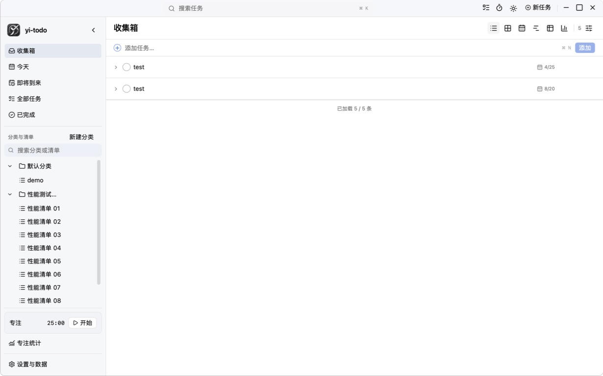
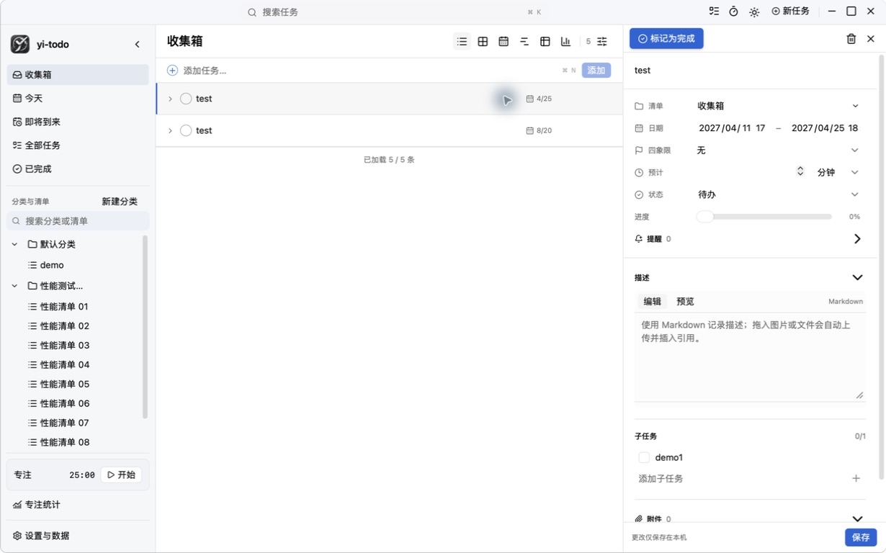

# yi-todo

yi-todo 是一款使用 Wails 3、Go、React、TypeScript 与 SQLite 构建的本地优先桌面任务管理应用。

应用始终以可执行文件旁的 SQLite 数据库作为唯一事实来源。React 只通过 Wails 生成的 bindings 调用 Go，不启动 localhost API。

## 核心优势

- **完全本地优先**：任务、设置、专注记录与附件默认只保存在本机，无网络也能使用，并提供一致性备份与事务恢复。
- **一套任务，多种视图**：列表、表格、日历、四象限和甘特图共享同一份任务数据，修改后无需在多个页面重复维护。
- **适合大量任务**：长列表与甘特图虚拟化、服务端分页筛选、SQLite FTS5 搜索，支持万级任务数据下持续工作。
- **完整的任务执行闭环**：多级分类与清单、六级子任务、Markdown 与附件、提醒、番茄钟及专注统计集中在桌面应用内。
- **原生桌面体验**：Wails 原生窗口、系统通知、快捷键、主题切换和跨平台安装包，同时保留 Go + SQLite 的低资源占用。

## 核心功能截图

### 高密度任务列表

快速创建、分层展开、按状态和时间筛选，并通过动态加载保持长列表流畅。



### 一体化任务详情

在同一侧栏内维护时间、四象限属性、进度、Markdown 描述、子任务与附件，所有修改直接持久化到本地数据库。



已实现能力还包括：嵌套分类与清单、Today/Upcoming 查询、命令搜索、四象限、FullCalendar、虚拟化甘特图、TanStack Table 分页表格、持久化番茄钟、后台提醒、ECharts 专注统计、Excel 导出以及自动/手动 SQLite 备份。

## Development

Requirements:

- Go 1.25 or newer
- Node.js 20 or newer
- Wails 3 CLI `v3.0.0-alpha2.105` or a compatible newer alpha

Install and verify:

```sh
cd frontend && npm install
cd ..
wails3 generate bindings -ts -i -clean=true
go test ./...
cd frontend && npm run typecheck && npm run build
cd ..
wails3 build
```

Run in development mode:

```sh
wails3 dev
```

yi-todo stores its database at `.yi-todo/yi-todo.db` beside the executable. Attachments, backups, logs, and cache are kept under the same `.yi-todo` directory.

## Keyboard

- `Cmd/Ctrl+N`: quick add
- `Cmd/Ctrl+K`: search (`project:`, `tag:`, `status:`, `after:`, and `before:` filters are supported)
- `Cmd/Ctrl+,`: settings and data
- arrows: task navigation
- space or `Cmd/Ctrl+Enter`: toggle/complete the selected task

## Packaging

`wails3 build` produces the native executable. `wails3 package` uses the platform tasks under `build/`. Each tagged release includes a Windows AMD64 installer and a portable ZIP containing `yi-todo.exe`. Distribution signing/notarisation credentials are intentionally not stored in the repository and must be supplied by the release environment.

Pushing a semantic-version tag such as `v0.0.5` starts the Release workflow. GitHub Actions builds Linux, Windows, and macOS packages, generates SHA-256 checksums, and publishes them to the matching GitHub Release. Regular pushes and pull requests run Go tests, TypeScript typechecking, and the frontend production build.
